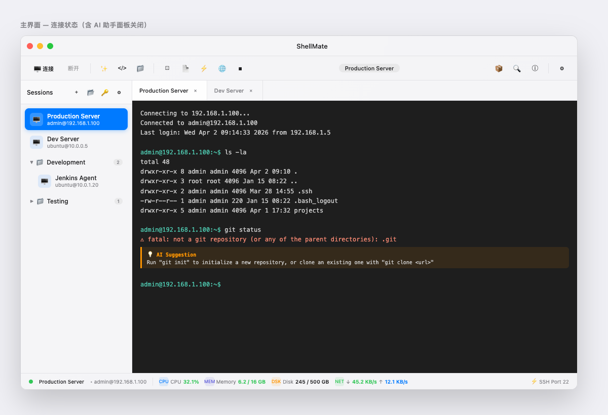
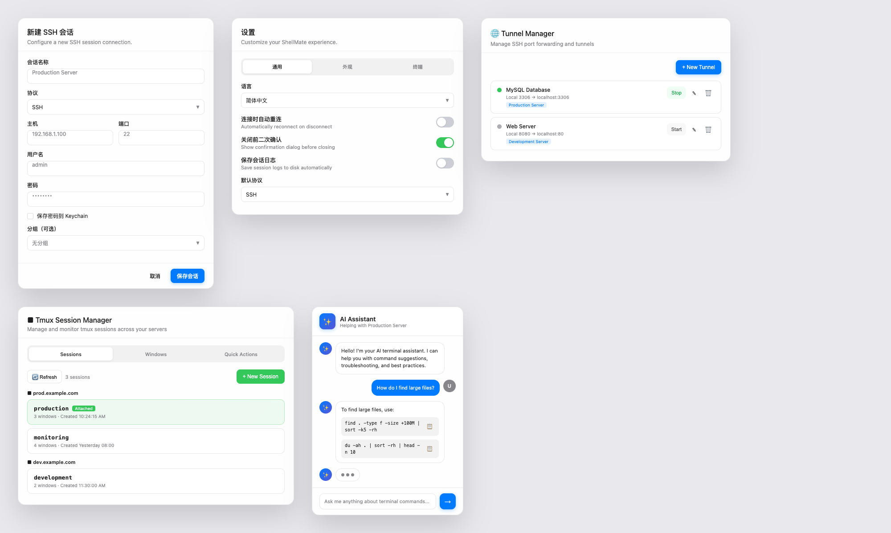

# Terminal Pro Figma Spec v2

> 基于 Figma Make 原型（`upl5OBUkpLGnOe1u5aQRZ5`）完全复刻生成的 UI 设计规范  
> 生成日期：2026-04-02

---

## 文件结构

```
Figma-Spec-v2/
├── README.md                      ← 本文件（总索引）
│
├── 00-总纲与设计令牌.md             颜色、排版、间距、圆角、阴影、动效全令牌
├── 01-整体布局规范.md               主界面层次结构、各区域尺寸、分屏模式
├── 02-侧边栏规范.md                 Sidebar 容器、会话行、文件夹行、状态
├── 03-工具栏规范.md                 Toolbar 三区段布局、按钮规范、分屏下拉
├── 04-终端区域规范.md               Tab 标签栏、终端视图、AI 提示组件、主题色
├── 05-状态栏规范.md                 连接指示、CPU/内存/磁盘/网络指标、刷新频率
├── 06-新建会话弹窗规范.md           NewSessionDialog 字段、验证、保存行为
├── 07-设置面板规范.md               SettingsDialog 五 Tab、Switch 组件规范
├── 08-文件传输面板规范.md           FileTransferPanel 双面板、文件列表、传输进度
├── 09-AI助手面板规范.md             AIAssistantPanel 消息气泡、命令块、输入区
├── 10-tmux管理器规范.md             TmuxManager 三 Tab、会话卡、窗口卡、快捷操作
├── 11-隧道管理器规范.md             TunnelManager 隧道列表、新建表单
├── 12-快捷命令管理器规范.md         QuickCommandManager 命令卡、分类、表单
├── 13-欢迎界面规范.md               WelcomeScreen 三步骤、英雄区、操作卡片
├── 14-其他弹窗规范.md               分组管理、密码管理、导入导出、日志、脚本自动化
│
└── previews/                       关键界面图片预览
    ├── main-window.png             ← 主界面（侧边栏+终端+状态栏）
    ├── dialogs-preview.png         ← 弹窗全览（新建会话/设置/隧道/tmux/AI）
    └── welcome-screen.png          ← 欢迎界面（第三步 Ready to Go）
```

---

## 设计语言速查

| 属性 | 值 |
|------|-----|
| 主色 | `#007aff` Apple Blue |
| 背景 | `#f5f5f7` Apple Gray |
| 文字主色 | `#1d1d1f` |
| 文字次色 | `#86868b` |
| 成功绿 | `#34c759` |
| 警告橙 | `#ff9500` |
| 错误红 | `#ff3b30` |
| 所有边框 | `#d2d2d7` / 50% 透明 |
| 弹窗圆角 | 16px |
| 按钮圆角 | 8px |
| 过渡时长 | 200ms |
| UI 字体 | `-apple-system` |
| 等宽字体 | `Menlo, Monaco, monospace` |

---

## 预览图

### 主界面


### 弹窗全览（新建会话 / 设置 / 隧道管理 / Tmux / AI 助手）


### 欢迎界面

