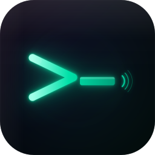

<p align="center">
  
</p>

<h1 align="center">ShellMate</h1>

<p align="center">
  面向专业开发者与运维工程师的 macOS 原生 SSH 会话管理工具
</p>

<p align="center">
  
  
  
  
</p>

---

## 简介

ShellMate 是一款专为 macOS 打造的原生 SSH 会话管理工具。与 Termius（Electron）和 SecureCRT（昂贵商业授权）不同，ShellMate 基于 SwiftUI + AppKit 构建，所有凭据仅存储于本机 Keychain，无任何云端数据上报。

**核心差异化：**

- **真正的 macOS 原生**：非 Electron / Web 技术，Apple Silicon 原生编译，内存占用极低
- **安全本地化**：密码与私钥仅存于设备 Keychain，不经过任何第三方服务器
- **买断制定价**：告别订阅疲劳，$14.99 一次性买断，可选 $4.99/年 Pro 订阅解锁 iCloud 同步
- **SSH 场景专属 AI**：错误自动诊断、上下文感知命令补全，而非通用代码助手

---

## 功能特性

### 核心功能

| 功能 | 描述 |
|------|------|
| **会话管理** | 无限会话，支持分组、搜索、拖拽排序，连接状态实时可见 |
| **SSH 认证** | 密码 / SSH Key（RSA/Ed25519/ECDSA）/ Touch ID / SSH Agent 转发 / ProxyJump 跳板机 |
| **终端仿真** | VT100 / xterm-256color / True Color，基于 SwiftTerm 渲染 |
| **多标签 + 分屏** | 支持单/水平/垂直/四格分屏布局，标签页可拖拽复位 |
| **SFTP 文件管理** | 可视化文件树，支持上传/下载/删除/重命名，并发传输 |
| **端口转发** | 本地 / 远程 / SOCKS5 三种隧道模式，规则持久化 |
| **快捷命令库** | 支持参数化变量，一键发送至单个或多个会话 |
| **关键词高亮** | 正则表达式规则引擎，自定义颜色分组 |
| **会话录制回放** | 以 asciicast 格式记录完整终端输出，支持回放 |

### 效率工具

| 功能 | 描述 |
|------|------|
| **Hotkey Window** | 全局浮动终端，⌥Space 随时唤起，不打断当前工作流 |
| **tmux 集成** | 可视化管理 tmux 会话/窗口/面板，支持新建与附加 |
| **Compose Pane** | 独立命令编辑区，支持同步输入到所有已连接会话 |
| **Telnet / Serial** | 额外支持 Telnet 协议与串口连接 |
| **自动化触发器** | 正则匹配终端输出 → 自动执行命令或发送通知 |
| **服务器监控** | 实时采集 CPU / 内存 / 磁盘 / 网络，超阈值推送系统通知 |
| **配置导入** | 支持从 Xshell、SecureCRT、`.ssh/config`、Termius 一键导入 |

### AI 智能助手

| 功能 | 描述 |
|------|------|
| **错误诊断** | 自动检测终端错误输出，结合服务器上下文给出修复建议 |
| **命令补全** | 基于最近 50 行终端历史生成上下文感知建议 |
| **会话摘要** | 将操作历史整理为 Markdown 报告 |
| **AI 服务配置** | 支持接入 Claude API / OpenAI API，API Key 存于 Keychain |

### 系统集成

- **iCloud 同步**（Pro）：会话配置、主题、触发器规则跨设备自动同步
- **Touch ID 解锁**：凭据库受 LocalAuthentication 保护
- **Known Hosts 管理**：主机指纹自动校验，防止中间人攻击
- **两个分发版本**：App Store 版（完整沙盒）/ Direct 版（完整 SSH Agent 访问权限）

---

## 系统要求

- macOS 13 Ventura 或更高版本
- Apple Silicon (M1+) 或 Intel Mac

---

## 从源码构建

```bash
# 克隆仓库
git clone https://github.com/jason-homelab/Shellmate.git
cd Shellmate

# 使用 Xcode 打开项目
open ShellMate/ShellMate.xcodeproj
```

> **注意：** 项目依赖预编译的 `libssh2.xcframework`（已随仓库附带，位于 `Frameworks/`），无需额外安装 Homebrew 依赖。SwiftTerm 通过 Swift Package Manager 自动拉取。

在 Xcode 中选择 **ShellMate** Scheme，选择目标设备，按 `⌘R` 构建运行。

---

## 技术栈

| 层次 | 技术 |
|------|------|
| 开发语言 | Swift 5.9+ |
| UI 框架 | SwiftUI + AppKit（NSViewRepresentable） |
| SSH 协议 | libssh2 1.11+（静态链接 XCFramework） |
| 终端渲染 | SwiftTerm |
| 数据持久化 | Core Data + `NSPersistentCloudKitContainer` |
| 凭据存储 | macOS Keychain Services |
| 云同步 | CloudKit Private Database |
| 架构模式 | MVVM + Store（单向数据流）+ Swift Concurrency |

---

## 项目结构

```
ShellMate/
├── App/                    # 应用入口、ContentView、Toolbar
├── Core/
│   ├── Models/             # 数据模型（Session、SessionGroup 等）
│   ├── Services/           # SSH、SFTP、AI、录制等服务层
│   ├── Stores/             # ObservableObject 状态仓库
│   └── Persistence/        # Core Data + Repository 层
├── Features/               # 功能模块（Terminal、Sidebar、Settings 等）
├── Shared/
│   ├── Components/         # 可复用 UI 组件
│   ├── Extensions/         # Swift 扩展
│   └── Utilities/          # DesignTokens、AppLogger 等
└── ShellMate.xcdatamodeld  # Core Data 数据模型
```

---

## 定价

| 方案 | 价格 | 包含内容 |
|------|------|----------|
| 免费试用 | 免费（14 天） | 全功能体验，会话数上限 3 个 |
| Standard（买断） | $14.99 一次性 | 无限会话 + 全部核心功能 |
| Pro（订阅） | $4.99 / 年 | Standard 全部 + iCloud 同步 + 高级主题 + 优先支持 |

---

## 开源协议

本项目基于 [MIT License](LICENSE) 开源。
