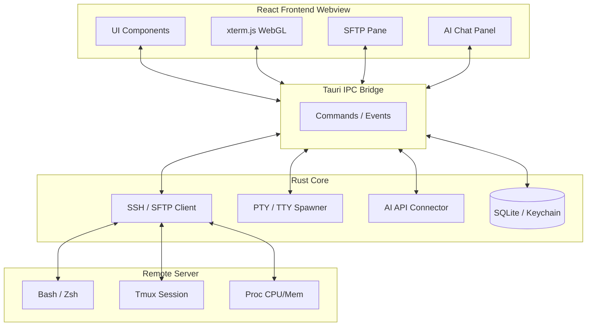

# ShellMate 产品与技术架构Review报告

## 1. 产品定位与核心价值萃取

**ShellMate** 是一款**面向现代化开发与运维的高阶 SSH 终端桌面应用**。在保留极致 macOS 原生视觉质感的同时，它打破了传统命令行工具“纯文本黑框”的体验边界，通过高度可视化的组件与人工智能的无缝融合，重新定义了终端工具的生产力标准。

**核心竞争力：**
1. **重塑「硬核」工具的交互范式**：将传统需依靠复杂指令堆砌的功能（Tmux 面板管理、SSH 隧道转发）转化为直观的可视化操作。
2. **AI Native 体验**：摆脱外挂式 AI 的割裂感。当命令执行报错时，AI 能够直接获取上下文进行诊断；在侧边栏即可享受对话式代码生成。
3. **“一站式”工作流**：整合多并发会话管理、双面板 SFTP 文件传输、服务器状态探针（CPU/内存监控）以及自动化脚本执行。

---

## 2. 核心功能与架构映射分析

从 Figma-Spec-v2 中提取的功能模块表明，ShellMate 的整体功能厚度极高。

### 2.1 基础连接与管理视图 (Base Protocol & Layout)
- **多 Tab 与分层收纳**：左侧边栏提供 `Production`, `Development`, `Testing` 多环境文件夹级层级管理，有效治理大规模实例资产。
- **状态栏环境探针**：底部常驻服务器 CPU、内存、网络、存储四大指标。这意味着**底层必须具备资源占用低且稳定的轮询探针机制**。
- **多协议扩展预留**：除核心支持 SSH 之外，设置中也预留了 Telnet / Serial 协议的支持空间。

### 2.2 高级生产力工具套件 (Productivity Suite)
- **SFTP 文件传输面板**：经典的「树状目录 + 双面板拖拽」交互，大大降低远程文件操作的学习曲线。
- **Tmux 可视化管理器**：此功能为业内罕见亮点，把极其陡峭的 `tmux` 命令曲线扁平化，可视化管理后台 Session 级的分屏与窗口。
- **SSH 隧道转发 (Tunneling)**：包含 Local 与 Remote 端口转发可视化配置，非常契合开发中对内网穿透以及查错的需求。

### 2.3 智能化模块 (AI Assistant Integration)
- **核心场景**：命令建议、代码生成、运行时报错精准分析（Auto-Error Diagnostics）。
- **个性化支持**：允许绑定自定义的大模型厂商 API（OpenAI, Anthropic 等）甚至是本地模型（如 Ollama）。

---

## 3. 推荐架构实现方案 (Technical Architecture Proposal)

为了支撑极致的 macOS GUI 动画、复杂多开的终端渲染和底层的原生协议处理，我们强烈建议采用 **Tauri + Rust + React** 架构，而非全量使用 Electron。

### 3.1 核心技术栈选型

* **展现层 (Frontend)**
  * **框架**: React 18 + TypeScript + Vite。
  * **样式系统**: Tailwind CSS。基于我们设计的 UI 体系 (`bg-white/95 backdrop-blur-2xl`)，Tailwind 非常适合实现毛玻璃与细粒度动画。
  * **UI 组件库**: Radix UI (原生支持无障碍访问与键盘逻辑) + Shadcn/ui，匹配 macOS 原生组件风格。
  * **终端渲染内核**: **xterm.js + xterm-addon-webgl**。针对海量编译日志输出，WebGL 插件能保证帧率不下降。

* **容器与业务控制层 (Backend / Desktop Container)**
  * **框架**: **Tauri v2** 
  * **语言**: Rust
  * **状态同步**: 后端保持真实的 TCP/SSH 会话长连接，通过 Tauri 的 IPC 通信，将 TTY 数据流实时推至前端 xterm 终端对象。

* **数据持久化与安全保护**
  * **配置存储**: SQLite（通过 Rust 驱动）用于存储庞大的终端资产、历史快捷命令与隧道配置。
  * **凭据安全**: 原生 OS Keychain API 管理服务器密码与私钥，**绝不允许明文存放在本地 SQLite 中**。

### 3.2 架构通信图

---

## 4. 关键技术卡点与破局之道 (Challenges & Solutions)

### 🔴 挑战 1：基于 SSH 的跨平台 Tmux 可视化抽象
Tmux 是一款纯命令行程序，如何在前端将其转化为完美的树状树结构（Sessions -> Windows -> Panes）？
* **破局建议**：不要依赖正则暴搜界面流。利用 `tmux -CC` (Control Mode 协议) 选项，或者在 Rust 后端中执行 `tmux list-windows -F "#{window_id}:#{window_name}"` 等内置格式化输出命令，解析结构化数据后经 IPC 同步至前端。

### 🔴 挑战 2：终端实时状态探针的性能开销
在状态栏高频（如 1 秒一次）展示 CPU / 内存可能会带来严重的底层 SSH 带宽抢占，甚至堵塞正在输入命令的 `stdin/stdout` 上下文。
* **破局建议**：绝对不能在主会话通道敲击检测命令。必须为同一个 Server 实例利用**复用的 SSH 连接 (Multiplexing)** 后台默默开启一条额外的极轻量 SSH Session 专职运行状态获取脚本。

### 🔴 挑战 3：终端内容渲染性能瓶颈
当出现 `cat` 巨型文件或快速 `npm install` 大量进度条刷新时，DOM/Canvas 会严重卡顿导致程序无法响应。
* **破局建议**：
  1. 开启 WebGL 渲染模式代替纯 DOM/Canvas。
  2. 针对高频数据流入开启 **Throttling (节流)** 机制，将多次 pty output 合并为一个屏幕刷新帧（RequestAnimationFrame）。
  3. AI 分析错误时，按阈值截断报错日志进行预提交，防止上下文超出 Token 极限并造成前端内存崩溃。

---

## 5. 产品下一步演进建议 (Evolution Roadmap)

**Phase 1：MVP 交付期 (0-3个月)**
跑通 SSH 稳定长连、xterm WebGL 渲染与多标签页管理。实现侧边栏资产增删改查。核心对标并超越原生终端的基础体验。

**Phase 2：效率溢价期 (3-6个月)**
发力可视化管理。完成 SFTP 拖拽、快捷命令触发器。正式接入大语言模型底层，打造核心的“报错解释（Explain Error）”高频爽点。

**Phase 3：生态与拓展期 (6个月以上)**
1. **多端/多设备数据同步**：基于 End-to-End Encryption（端到端加密）提供安全上云备份与同步。
2. **插件生态 (Plugin System)**：允许资深玩家使用 JavaScript 编写自定义主题、快速辅助工具板（如快捷调取 K8s Pod 日志的可视化面板）。
3. **团队版 / Team Collaboration**：允许一个团队共享开发环境配属（Host, Port, Public Keys 等，不共享私钥），形成企业级开发者套件（B2B 演进路线）。
